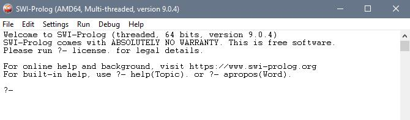

# Setting up Prolog
1. Open [this link](https://www.swi-prolog.org/download/stable) to download SWI-Prolog and select which appropriate platform to install.
2. Proceed with the default choices the installation setup has recommended in order to finish.
3. Once the installation has finished, SWI-Prolog should now be accessible.

# Getting started
1. TBD and the group members will probably have to begin [here](https://www.swi-prolog.org/pldoc/man?section=quickstart) or other guides.
### References
1. [Installing SWI-Prolog](https://wwu-pi.github.io/tutorials/lectures/lsp/010_install_swi_prolog.html).
